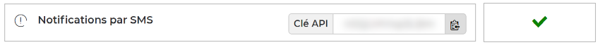

# Free Mobile for JS
Send SMS messages to your [Free Mobile](https://mobile.free.fr) device via any internet-connected device.

For example, you can configure a control panel or storage connected to your home network to send a notification to your mobile phone when an event occurs.

## Quick start
> SMS notifications require an API key. If you are not already registered, [sign up for a Free Mobile account](https://mobile.free.fr/subscribe).

### Get an API key
You first need to enable the **SMS notifications** in [your subscriber account](https://mobile.free.fr/account).
This will give you an identification key allowing access to the [Free Mobile](https://mobile.free.fr) API.



### Get the library
Install the latest version of **Free Mobile for JS** with [npm](https://www.npmjs.com) package manager:

```shell
npm install @cedx/free-mobile
```

For detailed instructions, see the [installation guide](installation.md).

## Usage
This library provides the `Client` class, which allow to send SMS messages to your mobile phone by using the `sendMessage()` method:

```js
import console from "node:console";
import {Client} from "@cedx/free-mobile";

try {
  const client = new Client("your account identifier", "your API key");
  await client.sendMessage("Hello World from Node.js!");
  console.log("The message was sent successfully.");
}
catch (error) {
  console.log(`An error occurred: ${error}`);
}
```

The `Client.sendMessage()` method returns a `Promise` that resolves when the message has been sent.

> The text of the messages will be automatically truncated to **160** characters: you can't send multipart messages using this library.

## See also
- [API reference](api/)
- [npm package](https://www.npmjs.com/package/@cedx/free-mobile)
